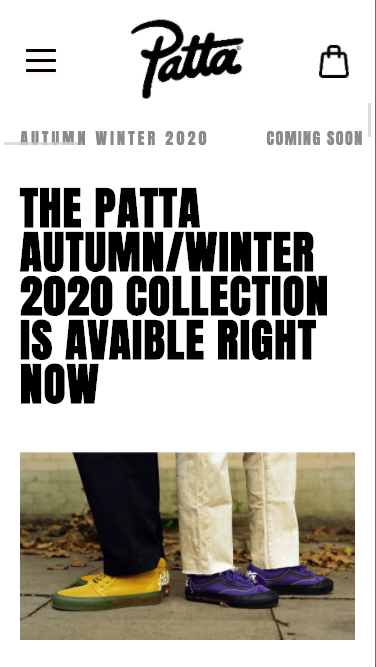
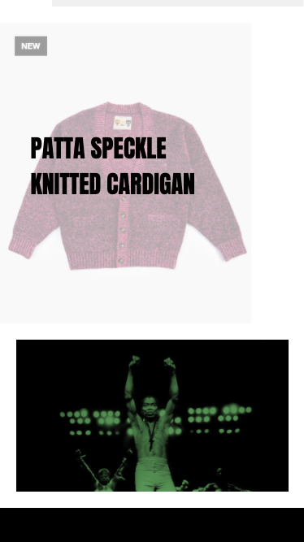
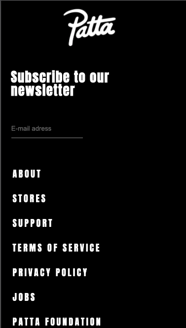
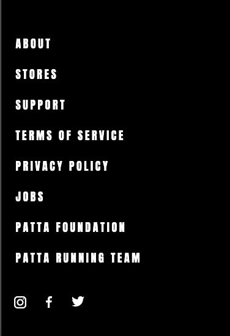

# Procesverslag

**Auteur:** Merijn Bakker

Dit is mijn procesverslag, voor zover je dat kan noemen. Door allerlei redenen ben ik niet blij met mijn proces van Frontend development. Maar dat heb ik helaas allemaal zelf gedaan.
Hier onder heb ik toch een proces proberen vorm te geven met het proces dat ik had.

## Bronnenlijst

1. -Patta-
2. -Youtube.com-

## Eindgesprek (week 7/8)

### Stand van zaken

In wat ik nog heb kunnen neerzetten was het niet moeilijk maar ook net makkelijk. Ik heb namelijk een pagina kunnen maken omdat ik nog vakken moest herkansen. Het hamburger menu maken was even uitvogelen maar ben er wel uit gekomen. De overlay maken was niet moeilijk maar kostte veel tijd en veel css regels. Ik heb niet alles kunnen verwerken wat
deze pagina verreiste. Daarnaast moest ik langer door na 18:00 dus dacht dat het inleveren beter geweest zodat Randy dit kon nakijken en bespreken. Het is erg minimaal maar ik wilde gewoon een gesprek kunnen hebben en
hoe ik dit volgende keer allemaal beter had kunnen doen, naast het plannen dan natuurlijk want daar ging dit vooral om. Veelste laat begonnen en dat is jammer, want ik merkte tijdens het coderen dat
ik het gewoon echt leuk vond en daar baal ik echt van.

**Screenshot(s):**

## Voortgang 3 (week 6)

Ook hier heb ik geen voortgang kunnen maken.

## Voortgang 2 (week 5)

Mijn voortgang van deze week is helaas zo gebleven.

## Voortgang 1 (week 3)

- Mijn voortgang is opzich best goed gegaan alleen had ik een beetje weinig. Dit omdat ik de tijd was veregeten. Wel was ik blij met het uiteindelijke resultaat en had ik zelfs al een beetje CSS gedaan dus daar was ik blij mee.

### Agenda voor meeting

- De eerste meeting was een uur voor het eerste gesprek dus dat was vrijdag 18 September om 9:50.

### Verslag van meeting

- De meeting was met Bas en mijn groepje. Ik heb erg aandachtig geluisterd naar de andere studenten om te kijken wat voor feedback zij kregen en of ik deze dan kon gebruiken en dat is gelukt. Zelf heb ik ook erg goede feedback kunnen krijgen om zo mijn ontwerp te gaan maken straks. Zoals: Logo moet in de NAV, shoppingbag en hamburger menu ook. Daarnaast kan ik pert 3 foto's alles per container stylen om zo het makkelijk voor mezelf te maken. Dus per 3 producten een container en deze dan zo stylen.

# Intake

## Startniveau

- Mijn start niveau gaat toch de blauwe piste worden, dit omdat ik toch al veel ben vergeten van vorig jaar en weer even moet wennen. Vorig jaar heb ik gemerkt dat JavaScript het lastigst is, Internetstandaarden en project gingen beter en zag daar ook meer plezier in. Het kan dus zijn dat ik langzamerhand de rode piste op kan alleen dan moet ik eerst mijzelf weer het coderen in krijgen, en dat moet zeker gaan lukken! -

## Keuze focus

- Ik ga een bestaande website namaken, dit omdat mij dat het leukste lijkt. Daarnaast heb ik vorig jaar niet enorm leuke dingen gemaakt waarmee ik dit zou kunnen doen. De website ga ik maken met extra aandacht voor de surface laag.

## De website

- Mijn website die ik ga namaken is patta.nl, dit is een kledingmerk website die ik interessant vind en interessante aspecten biedt om na te maken. Ik zat nog erg te twijfelen of ik het wel of niet moest doen aangezien het een webshop is. Dit ga ik dan ook aanstaande les vragen. [I'm an inline style link](https://www.patta.nl/) -

**Screenshot(s):**

**Breakdown-schets(en):**

