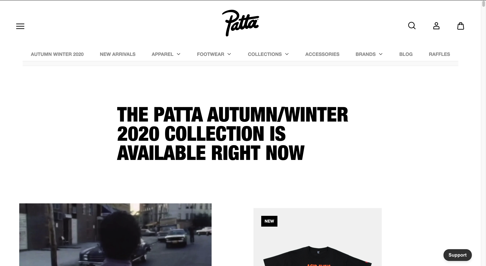
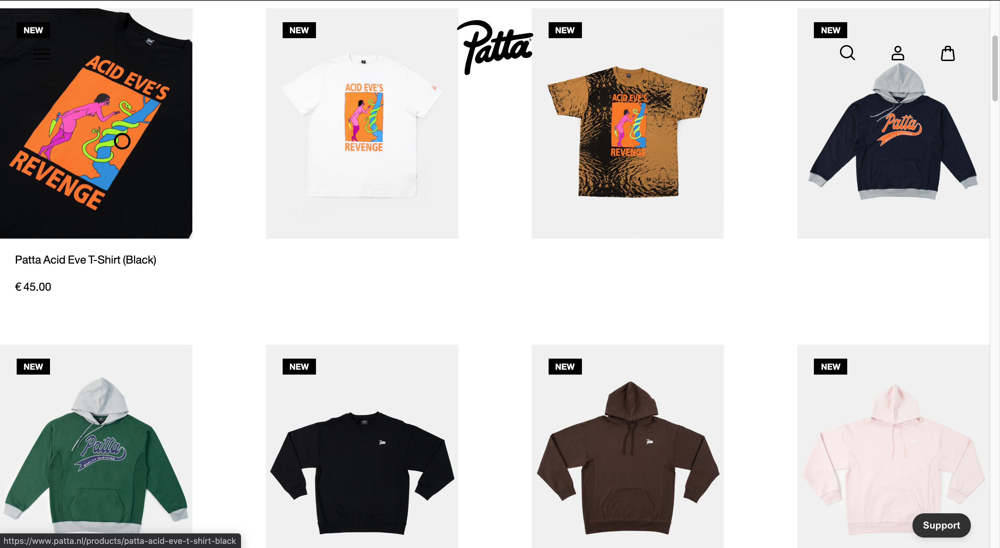
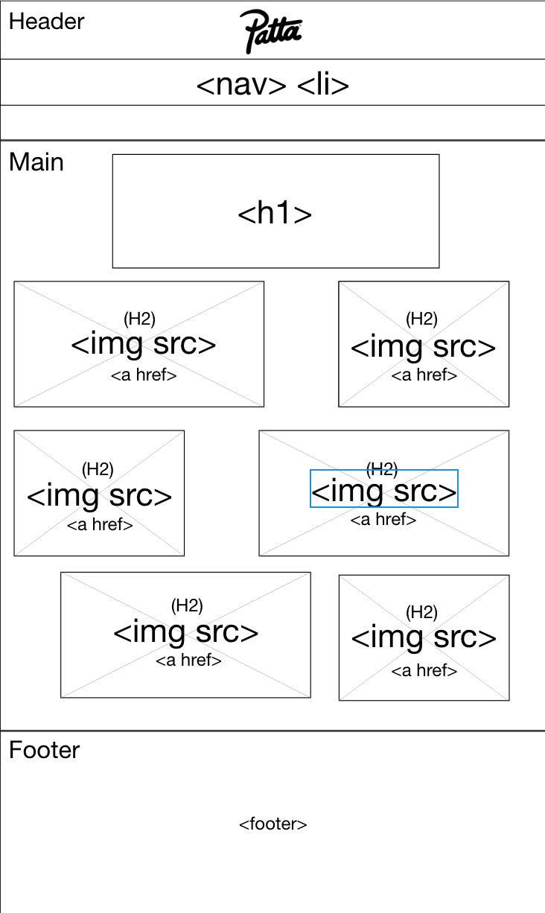

# Procesverslag

**Auteur:** -Merijn Bakker-

Markdown cheat cheet: [Hulp bij het schrijven van Markdown](https://github.com/adam-p/markdown-here/wiki/Markdown-Cheatsheet). Nb. de standaardstructuur en de spartaanse opmaak zijn helemaal prima. Het gaat om de inhoud van je procesverslag. Besteedt de tijd voor pracht en praal aan je website.

## Bronnenlijst

1. -bron 1-
2. -bron 2-
3. -...-

## Eindgesprek (week 7/8)

-dit ging goed & dit was lastig-

**Screenshot(s):**

-screenshot(s) van je eindresultaat-

## Voortgang 3 (week 6)

-same as voortgang 1-

## Voortgang 2 (week 5)

-same as voortgang 1-

## Voortgang 1 (week 3)

### Stand van zaken

-dit ging goed & dit was lastig-

**Screenshot(s):**

-screenshot(s) van hoe ver je bent-

### Agenda voor meeting

-samen met je groepje opstellen-

### Verslag van meeting

-na afloop snel uitkomsten vastleggen-

# Intake

## Startniveau

- Mijn start niveau gaat toch de blauwe piste worden, dit omdat ik toch al veel ben vergeten van vorig jaar en weer even moet wennen. Vorig jaar heb ik gemerkt dat JavaScript het lastigst is, Internetstandaarden en project gingen beter en zag daar ook meer plezier in. Het kan dus zijn dat ik langzamerhand de rode piste op kan alleen dan moet ik eerst mijzelf weer het coderen in krijgen, en dat moet zeker gaan lukken! -

## Keuze focus

- Ik ga een bestaande website namaken, dit omdat mij dat het leukste lijkt. Daarnaast heb ik vorig jaar niet enorm leuke dingen gemaakt waarmee ik dit zou kunnen doen. De website ga ik maken met extra aandacht voor de surface laag.

## De website

- Mijn website die ik ga namaken is patta.nl, dit is een kledingmerk website die ik interessant vind en interessante aspecten biedt om na te maken. Ik zat nog erg te twijfelen of ik het wel of niet moest doen aangezien het een webshop is. Dit ga ik dan ook aanstaande les vragen. [I'm an inline style link](https://www.patta.nl/) -

**Screenshot(s):**

**Breakdown-schets(en):**

